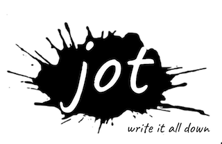
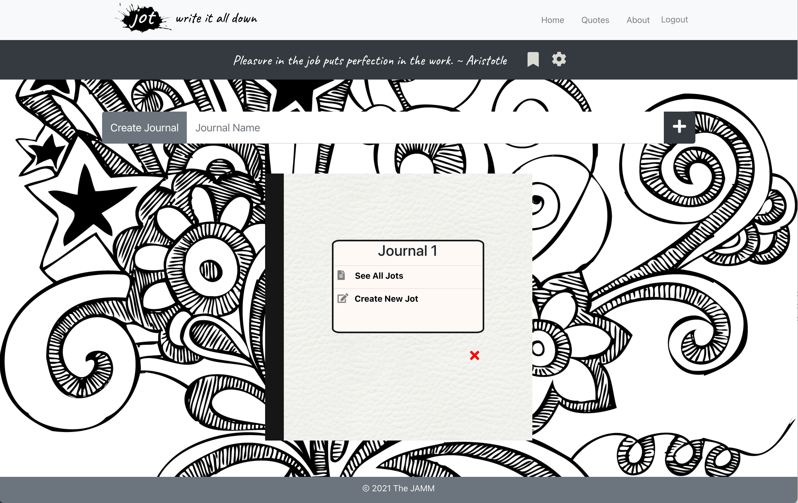
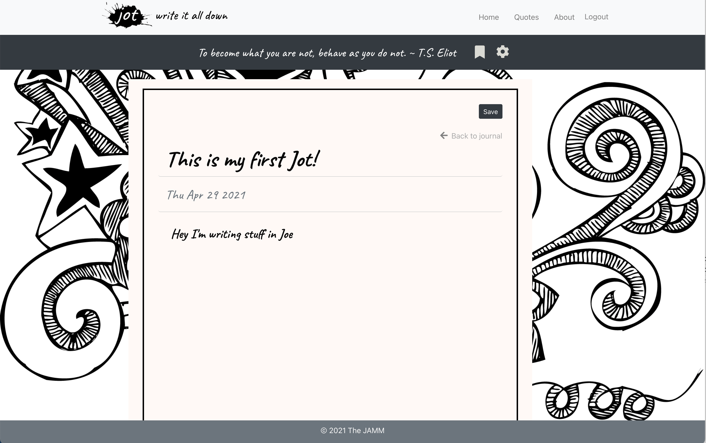
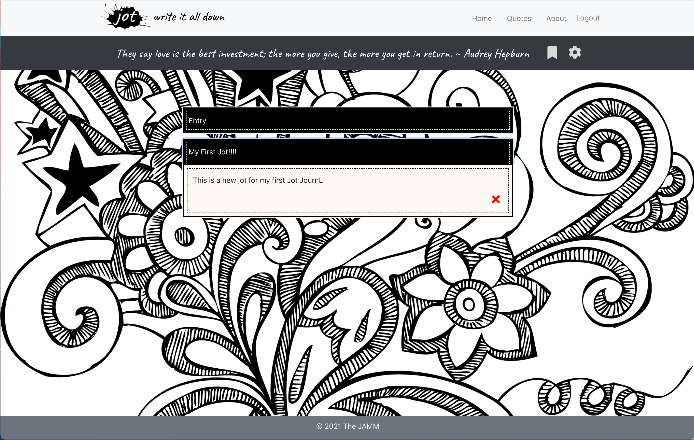
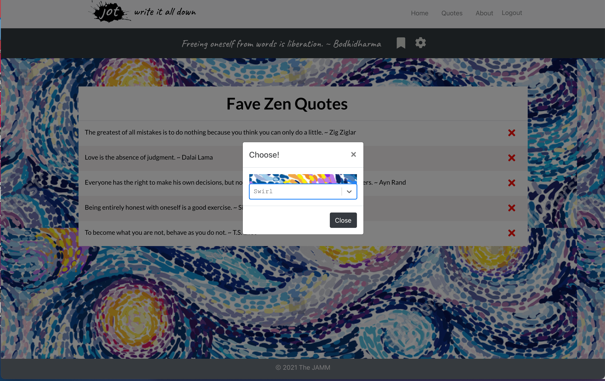
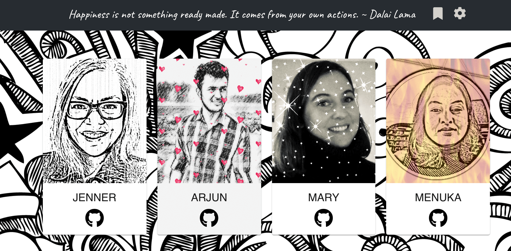

# Project 3: 

# Table of Contents
- [Description](#Description)
- [Technologies](#Technologies)
- [Installation](#Installation)
- [Usage](#Usage)
- [Repositories](#Repositories)
- [Deployment](#Deployment)
- [Screenshots](#Screenshots)

## Description
Jot is a MERN (Mongo,Express, React and Node) App. User can register to this app and login to write and save Journals. App has a feature of motivational quote. Every time user logged in , app gives you new motivational quote. User can also set up a theme for their Journal by selecting theme option.

## Technology
Technologies utilized include
- Mongo DB
- Express.js
- React
- Node.js
- Javascript
- HTML & CSS
- Heroku

## Installation
To runs this application you must have Mongo DB,  Node.js and React installed. Once installed:
1. Clone the git hub repo.
2. In the terminal, navigate to source folder and install the required dependencies listed in the package.json file by entering `npm install` or `npm i` and `ENTER`. Navigate to server.js 
3. 

## Usage

1. Once the above installation steps have been completed, right click on the `server.js` and `Open in an internal/external terminal`
2. The application is launched by typing `npm start` in the terminal.
3. NOTE: If you're new to using backend servers remember: `Ctrl C` at an active server prompt will "end/kill" the server connection when/if necessary.

## Repository

## Deployment

- Git hub link  https://github.com/ghimirear/the-jamm
- Heroku link https://pacific-river-65796.herokuapp.com/**
** NOTE re known issues: Upon deployment, site responsiveness on the the login and registration page, as well as some styles on the journal page were severly altered. Other issues have also come up and will be resolved in the coming weeks.

## Screenshots

### Create a journal or multiple journals

### Create a jot - Write it all down!

### See all jots for a particular journal and read (update coming)

### Change the scenery of your writing space to match your mood

### Receive daily inspirational Zen Quotes....

### ...and save your favorties!

Team JAMM - Jenner, Arjun, Mary, Menuka

